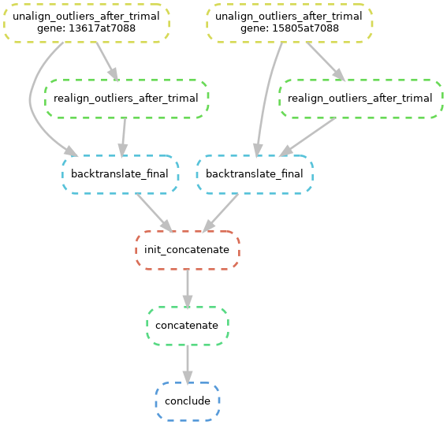

# PCC (Phylogenetic dataset Compiler Collection)

This is a simple and crudely made Snakemake workflow for compiling phylogenetic datasets from extracted coding sequences of **nuclear** (for now) protein-coding genes.
It can work reasonably well with sequences retrieved by running BUSCO as input. There is very little flexibility as to the tools used for the different steps and the parameters as this mainly for my personal use at the moment. I plan to add new functionality (alternative tools for the same rules, or more options in the rules themselves) later.

## What do you need to use it
You need to have `snakemake` installed, which can be installed using `conda` into its own environment. I will add an `environment.yaml` for this workflow that will make things easier later.

You need to have all your input genes as fasta files in `input/genewise_fastas` (relative to the project root directory), and their names in a single-column (for now) `gene_table.tsv` file in the project root directory that looks like this:

(First line is a header)
```
gene
geneName1
geneName2
```

assuming that you have the FASTA files in paths like:

```
input/genewise_fastas/geneName1.fa
input/genewise_fastas/geneName2.fa
```

Gene names should not have any underscores or hyphens or any other breaking character (for now) they can only include alphanumeric characters (upper or lowercase letters are fine). FASTA files themselves are exptected to have the extension `.fa` and not any other common versions such has `.fna` or `.fasta`

## Explanation of the workflow

It is only possible to run it in three distinct steps with the target rules are named as `first_pass`, `second_pass`, and `conclude`.

``` bash
snakemake --sdm conda --cores <NUM_THREADS> first_pass
```


Would do:
  1. Align the translated gene sequences by `mafft` with the `L-INS-i` algorithm
  2. Backtranslate the aligned amino-acid alignments into nucleotide alignments
  3. Remove fasta entries from genes that consist of gaps entirely (Genes that had a header but no sequence in the input nucleotide fasta files)
  4. Infer gene trees using IQ-TREE
  5. Collect all gene trees into a single `.treefile`
  6. Run a basic gene/sequence filtering script based on relative branch lenghts within each gene tree.
  7. Remove sequences from gene alignment (or discard entire gene alignments) according to the output of the previous step.

``` bash
snakemake --sdm conda --cores <NUM_THREADS> second_pass
```


  8. Unalign the the processed gene alignment sequences that made the filtering step, translate into amino-acid sequences.
  9. Realign the amino-acid sequences
  10. Run `trimAl` with `--automated1` heuristic to mark candidate columns to retain after getting rid of gap-rich columns and backtranslate the amino-acid alignment to a nucleotide alignment while only keeping the columns deemed ok by `trimAl`.
  11. Repeat steps 5-7 for the trimal-processed alignments.

``` bash
snakemake --sdm conda --cores <NUM_THREADS> conclude
```



  12. Repeat steps 8,9 for the trimal-processed alignments.
  13. Backtranslate the resulting amino-acid alignments.
  14. Collect the final nucleotide alignments into a directory
  15. run `concat-aln` to concatenate the genewise alignments into a supermatrix in `PHYLIP` format (`output/supermatrix.phy`) and also generate a partition table in the `NEXUS` format (`output/supermatrix.nex`)
